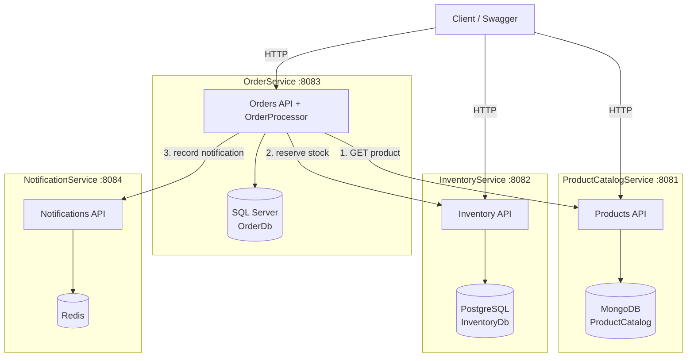
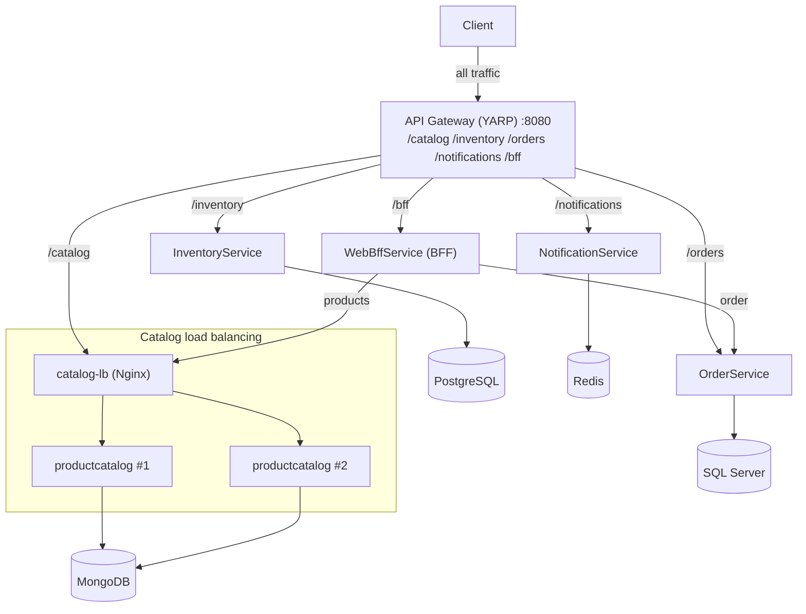

# Phase 2 — Microservices Architecture

Phase 1 was a single monolith with one SQL Server database. In Phase 2 we split
it into **four independent services**, each owning **its own database**
(database-per-service) with **polyglot persistence**. Services talk to each other
**synchronously over HTTP** (no message broker yet — that is Phase 4).

## Services and their databases

| Service | Responsibility | Database | Family | Host port |
|---|---|---|---|---|
| ProductCatalogService | Create/list/get/update products | MongoDB | Document | 8081 |
| InventoryService | Get/update/reserve/release stock | PostgreSQL | Relational | 8082 |
| OrderService | Place + read orders, orchestrate the flow | SQL Server | Relational | 8083 |
| NotificationService | Record/"send" notifications | Redis | Key-value | 8084 |

Each service exposes Swagger at its root (`http://localhost:<port>/`) and a
`/health` endpoint.

## Diagram



**Key rule:** every database arrow stays inside its own service box. No service
reads or writes another service's database — the only cross-service access is the
HTTP arrows out of OrderService.

## Order placement flow (synchronous)

1. Client calls `POST /api/orders` on **OrderService**.
2. For each line, OrderService calls **ProductCatalogService** `GET /api/products/{id}`
   to confirm the product exists, is active, and to snapshot its name + price.
3. For each line, OrderService calls **InventoryService** `POST /api/inventory/{productId}/reserve`.
   - If any reservation fails, previously reserved lines are released
     (`/release`) — a best-effort, synchronous compensation.
4. If all reservations succeed, OrderService saves a **Confirmed** order in its
   own SQL Server database; otherwise it saves a **Rejected** order with a reason.
5. OrderService calls **NotificationService** `POST /api/notifications` to record
   the outcome (Confirmed or Rejected). NotificationService stores it in Redis
   and logs the "sent" message.

## Endpoints

### ProductCatalogService (:8081)
- `POST /api/products`, `GET /api/products`, `GET /api/products/{id}`, `PUT /api/products/{id}`

### InventoryService (:8082)
- `GET /api/inventory/{productId}`
- `PUT /api/inventory/{productId}` (set/upsert quantities)
- `POST /api/inventory/{productId}/reserve`
- `POST /api/inventory/{productId}/release`

### OrderService (:8083)
- `POST /api/orders`, `GET /api/orders`, `GET /api/orders/{id}`

### NotificationService (:8084)
- `POST /api/notifications`, `GET /api/notifications`, `GET /api/notifications/{id}`

## What is intentionally NOT here yet

Async messaging and a real choreography saga (Phase 4), Redis cache-aside
(Phase 4), and monitoring + correlation IDs (Phase 5). Inter-service calls are
plain synchronous HTTP, which is acceptable "for now" per the course brief.

> **Phase 3 update:** API Gateway, BFF and load balancing have now been added —
> see the next section.

---

# Phase 3 — API Gateway, BFF & Load Balancing

Phase 3 puts an **API Gateway** in front of the Phase 2 services, adds a **BFF**
for client-specific aggregation, and runs **ProductCatalogService behind a load
balancer with 2 replicas**. The gateway is the **only** entry point exposed to
the host; every other service is internal to the Docker network.

## New components

| Component | Tech | Role | Exposed? |
|---|---|---|---|
| ApiGateway | YARP | Single entry point; routes by path prefix | **Yes — host :8080** |
| WebBffService | .NET 8 WebAPI | Aggregates order + product data for a web client | Internal (via `/bff`) |
| catalog-lb | Nginx | Load balances the ProductCatalogService replicas | Internal |
| productcatalog (×2) | .NET 8 WebAPI | 2 replicas behind catalog-lb | Internal |

## Diagram



Every database arrow still stays inside its own service — database-per-service is
unchanged. The only new traffic is through the gateway and the catalog LB.

## Gateway routes (YARP)

YARP strips the prefix and forwards the rest. All via `http://localhost:8080`:

| Gateway path | Forwarded to | Becomes |
|---|---|---|
| `/catalog/api/products/**` | catalog-lb → productcatalog | `/api/products/**` |
| `/inventory/api/inventory/**` | inventory | `/api/inventory/**` |
| `/orders/api/orders/**` | order | `/api/orders/**` |
| `/notifications/api/notifications/**` | notification | `/api/notifications/**` |
| `/bff/api/order-details/**` | webbff | `/api/order-details/**` |

## Gateway vs BFF — the boundary

- **Gateway (YARP):** generic, domain-agnostic **routing** and the single entry
  point. It maps one inbound path prefix to one backend and forwards the request
  unchanged. It is also where cross-cutting **edge** concerns belong (routing,
  and later rate limiting / auth). It never combines or reshapes domain data.
- **BFF (WebBffService):** **client-specific aggregation**. `order-details` is
  not one backend resource — the BFF calls OrderService *and*
  ProductCatalogService and composes a single response shaped for a web client.
  This domain knowledge must not leak into the gateway.

Rule of thumb: **fan-out-to-one → Gateway; fan-in-from-many → BFF.** The client
reaches the BFF *through* the gateway (`/bff/api/order-details/{id}`).

## Proving load balancing

ProductCatalogService stamps every response with an `X-Instance-Id` header (the
container hostname) and exposes `GET /api/products/instance`. With 2 replicas
behind Nginx:

```bash
# Repeated calls alternate between the two container ids:
for i in $(seq 1 10); do curl -s http://localhost:8080/catalog/api/products/instance; echo; done

# Or watch the response header:
curl -s -D - -o /dev/null http://localhost:8080/catalog/api/products | grep -i x-instance-id
```

**Resilience:** stop one replica and the gateway keeps serving from the other:

```bash
docker stop project-ai-productcatalog-1
curl -s http://localhost:8080/catalog/api/products/instance   # still 200, from the survivor
docker start project-ai-productcatalog-1
```

### Why Nginx with a DNS variable

Open-source Nginx resolves an `upstream server <name>` only once at startup,
which breaks with scaled replicas. The config uses Docker's embedded DNS resolver
(`127.0.0.11`) plus a variable in `proxy_pass`, so Nginx re-resolves the
`productcatalog` service name at request time; Docker returns all replica IPs and
rotates them, producing round-robin balancing. (Scale further with
`docker compose up -d --scale productcatalog=3`.)

## ADRs

Database choices are justified in [docs/adr/](./adr):
- [0001 — ProductCatalogService → MongoDB](./adr/0001-productcatalog-mongodb.md)
- [0002 — OrderService → SQL Server](./adr/0002-orderservice-sqlserver.md)
- [0003 — InventoryService → PostgreSQL](./adr/0003-inventoryservice-postgresql.md)
- [0004 — NotificationService → Redis](./adr/0004-notificationservice-redis.md)
