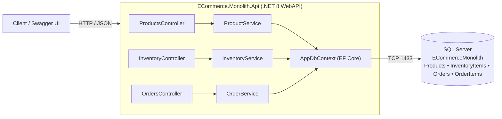

# Phase 1 — Monolith Architecture

This document describes the Phase 1 baseline: a single .NET 8 WebAPI
("the monolith") backed by one SQL Server relational database.

## 1. Diagram

Everything runs inside **one process**. Products, Inventory and Orders are
just folders/classes — not separate deployables. All four tables live in
**one** database, which is what makes this a monolith with a single
relational store.

## 2. Endpoints

### Products
| Method | Route | Purpose |
|--------|-------|---------|
| POST   | `/api/products`        | Create a product (also creates its inventory row) |
| GET    | `/api/products`        | List all products |
| GET    | `/api/products/{id}`   | Get one product |
| PUT    | `/api/products/{id}`   | Update a product |

### Inventory
| Method | Route | Purpose |
|--------|-------|---------|
| GET    | `/api/inventory/{productId}` | Read current stock for a product |
| PUT    | `/api/inventory/{productId}` | Set available/reserved quantities |

### Orders
| Method | Route | Purpose |
|--------|-------|---------|
| POST   | `/api/orders`      | Place an order (checks stock, reserves it, confirms) |
| GET    | `/api/orders`      | List all orders |
| GET    | `/api/orders/{id}` | Get one order |

### Utility
| Method | Route | Purpose |
|--------|-------|---------|
| GET    | `/health` | Liveness check (used by demos/healthchecks) |

## 3. Three problems this architecture will have at scale

1. **Single point of scaling & failure.** Products, Inventory and Orders
   are deployed together, so you cannot scale just the hot path (e.g. order
   placement) — you must scale the whole API. One bad code path or memory
   leak takes down the entire system.

2. **Shared database coupling.** Every concern reads and writes the same
   database. Schema changes for one area risk breaking others, the database
   becomes a contention bottleneck under load, and you cannot pick the best
   storage technology per concern (e.g. a document DB for the catalog).

3. **Tight coupling & blocking workflows.** Order placement does stock
   checking, reservation and confirmation synchronously in one transaction.
   There is no asynchronous decoupling, no independent retry/compensation,
   and no isolation — a slow notification step (later) would block the order
   response. Teams also cannot deploy independently.

## 4. Why it is intentionally simple

This monolith exists as a **baseline to compare "before vs. after"**. It is
deliberately not gold-plated: no message broker, no caching, no gateway, no
authentication. In later phases it will be split into independent services
(`OrderService`, `ProductCatalogService`, `InventoryService`,
`NotificationService`) with database-per-service, an API gateway and a BFF,
asynchronous messaging with a saga, distributed caching, and monitoring with
correlation IDs. Starting simple makes those improvements measurable and
defensible.
